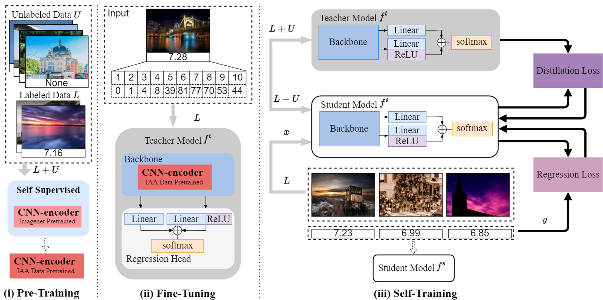

# Improving Image Aesthetic Assessment via Efficient Self-Training
This is the official pytorch implementation of the IAA_SSL:

<div align = "center">

 </div>
 <br />

# Requirements
CUDA 11.0

PyTroch 1.7.0

Python 3.8

Torchvision 0.8.2

# Usage
## Installation
Install Pytorch1.7, nnUNet as below:
```bash
pip install torch==1.7.1+cu110 torchvision==0.8.2+cu110 torchaudio==0.7.2 -f https://download.pytorch.org/whl/torch_stable.html

```
## Data preprocessing
1.Download [AVA Dataset](https://) and [AADB Dataset](https://) 

* Dataset path and root path 

You should modify the data root directory and storage directory in the .yaml file located in the configs folder.
 
## Pre-Training

* This framework only supports pre-training using the SWAV, SimCLR, SimSiam, and BYOL methods. How to train VICReg, please refer to [VICReg](https://github.com/facebookresearch/vicreg) for specific details.
 
`Python pretrain_main.py -c xxx.yaml`

* Linear evaluation

`Python linear_eval.py -c xxx.yaml`

 ## Fine-tuning
 
`Python fine_tune_main.py -c xxx.yaml`
 
## Self-training
  
`Python self_training.py -c xxx.yaml`
  
   
## 5. Acknowledgements
Part of codes are reused from the [SimSiam](https://github.com/PatrickHua/SimSiam). Thanks to PatrickHua for the codes of SimSiam.

## Contact

Ruiyang Li(liruiyang@stu.xidian.edu.cn)
  
 
